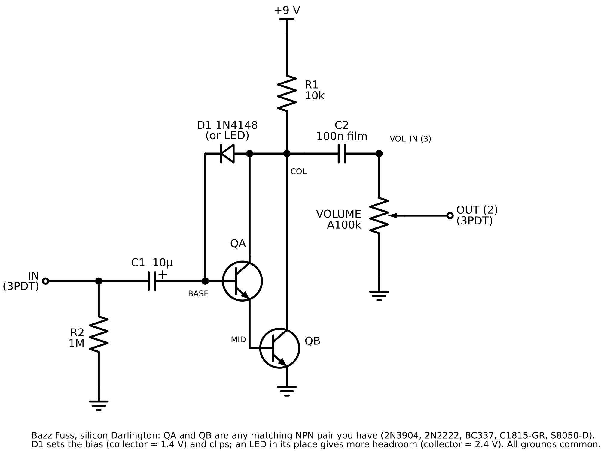

# Bazz Fuss, silicon Darlington (prototype)

Status: **proposed**, 2026-10-03. Netlist simulated in ngspice; not yet built or bench-tested. Unlisted build guide at `/guitars/pedals/bazz-fuss` (source `content/pedals/bazz-fuss.mdx`); after regenerating, copy the PNGs to `public/images/bazz_fuss/guide/`.

Owner request: a Bazz Fuss from on-hand parts, no germanium, 1N4148 or LED clipping.

## Design

Dave Barber's Bazz Fuss: one gain stage whose only bias is a diode from collector to base. The original uses an MPSA13 Darlington. You have no Darlington, so QA and QB are two NPNs wired as one (QA emitter to QB base). Any matching pair from your stock works: 2N3904, 2N2222, BC337-25, C1815-GR or S8050-D.

D1 (anode to collector, cathode to base) both biases the stage and clips it. Swapping D1 for an LED, same orientation, raises the collector voltage and gives more output and a more open fuzz.

## Parts

| Ref    | Value              | Notes                                                                                       |
| ------ | ------------------ | ------------------------------------------------------------------------------------------- |
| QA, QB | NPN pair           | 2N3904 shown. See the pinout note below.                                                    |
| R1     | 10 kΩ              | Collector load                                                                              |
| R2     | 1 MΩ               | Input pulldown, stops switch pop                                                            |
| C1     | 10 µF electrolytic | + to the base. The stage's input impedance is low, so a small film cap here would cut bass. |
| C2     | 100 nF film        | Output coupling                                                                             |
| D1     | 1N4148             | Or any LED, long leg (anode) to the collector                                               |
| VOLUME | A100k              | Lug 3 VOL_IN, lug 2 output, lug 1 GND                                                       |

Footswitch, jacks, LED indicator and battery wire the same as the Fuzz Face (`../fuzz-face/fuzz-face-footswitch.png`): board IN pad to 3PDT lug 2, VOLUME lug 2 to 3PDT lug 3.

## Expected readings (ngspice, 2N3904 models, 9 V)

| Node              | 1N4148      | Red LED     |
| ----------------- | ----------- | ----------- |
| Collector         | 1.36 V      | 2.41 V      |
| QA base           | 1.19 V      | 1.18 V      |
| QB base (MID)     | 0.66 V      | 0.65 V      |
| Output, 100 mV in | ≈ 1.1 V p-p | ≈ 2.3 V p-p |

Real parts will differ by a few hundred millivolts with transistor gain and LED colour.

## Pinout warning

2N3904, 2N2222 (TO-92), BC337 and the 2N3906 read E-B-C facing the flat side. C1815, A1015, S8050 and S8550 read E-C-B. The layouts are drawn for E-B-C; with an E-C-B part, rotate or bend legs so each leg still lands on its labelled hole.

## Files

- `bazz-fuss-schematic.svg` / `.png`: schematic
- `bazz-fuss-breadboard.svg` / `.png`: half-size breadboard layout
- `bazz-fuss-stripboard.svg` / `.png`: 14 × 6 stripboard, component and copper sides
- `generate.py`: draws all three; checks both layouts against the netlist first
- SPICE check: `../pedal-diagrams/spice/bazz-fuss.cir`

## Open items

- Bench-test and record collector voltage, sound notes, and which LED colour you prefer.
