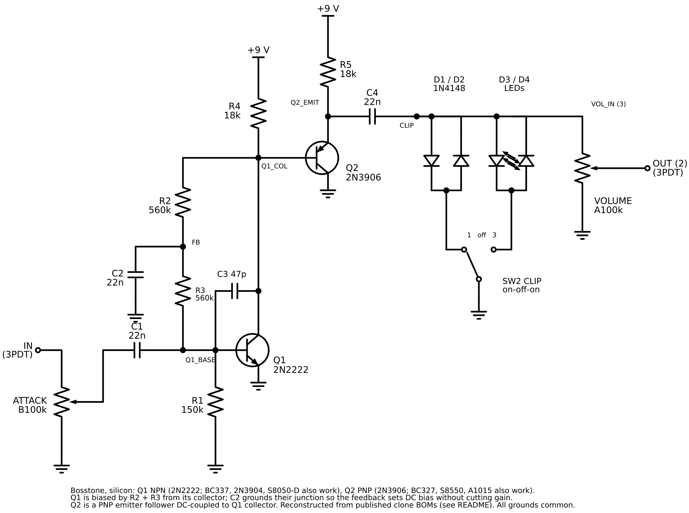

# Bosstone, silicon (prototype)

Status: **proposed**, 2026-10-03. Netlist reconstructed and simulated in ngspice; not yet built or bench-tested. Unpublished; no site route.

Owner request: a Bosstone (Jordan Boss Tone) from on-hand parts, no germanium, 1N4148 or LED clipping.

## Source and confidence

Values come from two published clone parts lists, which agree: General Guitar Gadgets' JBT (R 150k, 560k, 560k, 18k, 18k; C 22n ×3, 51 pF; 2N2222 + 2N3906; 1N914 pair; 100k attack and volume) and PedalParts' Bosstone v2 (the same, with 47 pF and 1N4148s, plus optional switchable diodes). Neither schematic image could be read here, so the topology was reconstructed from those lists and PedalPCB's written circuit walk-through:

- Q1 NPN common emitter, emitter grounded, 18k load. R2 + R3 (560k each) bias it from its own collector; C2 grounds their junction, so the feedback sets DC bias without lowering AC gain. R1 (150k) base to ground. C3 (47 pF) collector to base trims fizz.
- Q2 PNP emitter follower, base DC-coupled to Q1 collector, collector grounded, emitter to +9 V through 18k.
- C4 couples to the clipping diodes and VOLUME.

The ngspice check (below) gives sensible bias with these connections. **Compare against the GGG schematic PDF before committing to a stripboard**, and flag anything that differs.

## Parts

| Ref        | Value                 | Notes                                           |
| ---------- | --------------------- | ----------------------------------------------- |
| Q1         | 2N2222 (NPN)          | Or BC337-25, 2N3904, S8050-D                    |
| Q2         | 2N3906 (PNP)          | Or BC327, S8550, A1015                          |
| R1         | 150 kΩ                | Q1 base to GND                                  |
| R2, R3     | 560 kΩ                | Collector-to-base bias chain                    |
| R4, R5     | 18 kΩ                 | Q1 collector load; Q2 emitter load              |
| C1, C2, C4 | 22 nF film            | Input, bias-chain bypass, output                |
| C3         | 47 pF ceramic         | Q1 collector to base                            |
| D1, D2     | 1N4148                | Opposed pair                                    |
| D3, D4     | LED × 2               | Opposed pair; same colour                       |
| ATTACK     | B100k                 | Input level: lug 3 from 3PDT lug 2, lug 2 to C1 |
| VOLUME     | A100k                 | Lug 3 CLIP, lug 2 to 3PDT lug 3                 |
| SW2        | SPDT on-off-on toggle | Lug 1 1N4148 pair, lug 2 GND, lug 3 LED pair    |

Footswitch, jacks, LED indicator and battery wire as the Fuzz Face (`../fuzz-face/fuzz-face-footswitch.png`).

## Expected readings (ngspice, 9 V, no signal)

| Node                | Voltage |
| ------------------- | ------- |
| Q1 base             | 0.59 V  |
| Q1 collector        | 6.30 V  |
| Q2 emitter          | 6.95 V  |
| R2/R3 junction (FB) | 3.45 V  |

Small-signal gain to the clip node is about 37 dB at 1 kHz and 26 dB at 100 Hz (the 22 nF caps thin the bass, as in the original). Clipped output: about ±0.55 V with 1N4148s, ±1.6 V with LEDs.

## Pinout warning

2N2222 (TO-92) and 2N3906 read E-B-C facing the flat side, as drawn. C1815, A1015, S8050 and S8550 read E-C-B; rotate or bend legs so each lands on its labelled hole. A metal-can 2N2222 has a different pinout entirely.

## Files

- `bosstone-schematic.svg` / `.png`, `bosstone-breadboard.svg` / `.png`, `bosstone-stripboard.svg` / `.png` (18 × 8)
- `generate.py`: draws all three; checks both layouts against the netlist first
- SPICE check: `../pedal-diagrams/spice/bosstone.cir`

## Open items

- Confirm the topology against the GGG schematic (see above).
- Bench-test; record voltages and sound notes.
