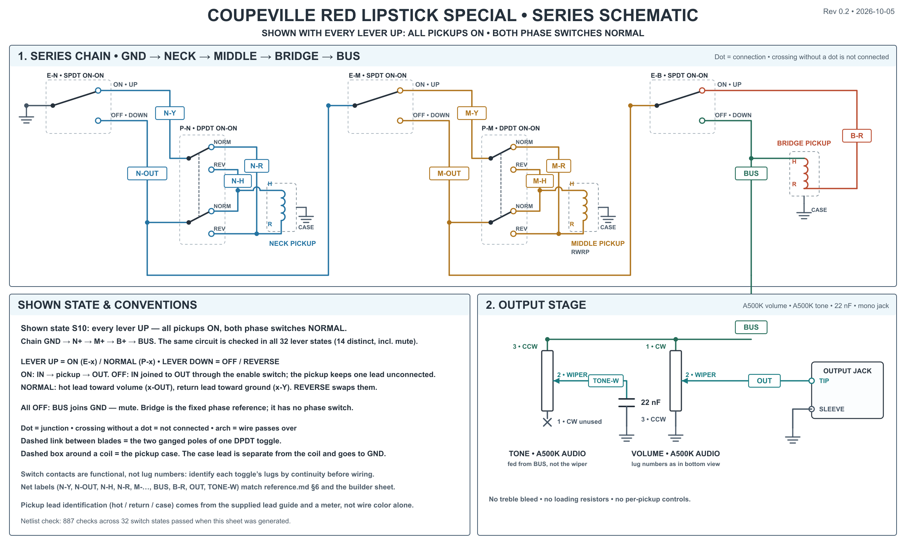
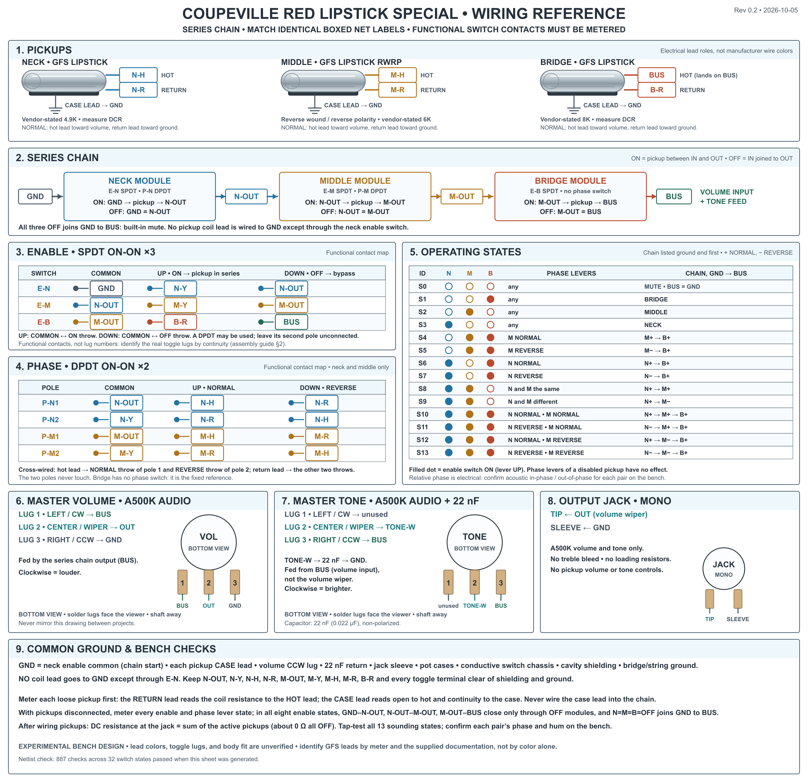

# Coupeville Red Lipstick Special — wiring specification

**Status:** Draft Rev 0.2 · 2026-10-05. The owner approved Rev 0.1 on 2026-10-05 and asked for the build. Rev 0.2 adds the owner-reported pickup lead interface (untested), the two drawing sheets, and the netlist and drawing checkers. Nothing has been built, bench-tested, or listened to.

**Source:** [Owner engineering handoff](./engineering-handoff.md), plus owner-confirmed chat decisions on 2026-10-05 (name; pickup orientation; lever defaults) and the owner's report of the pickups' three-wire lead interface (2026-10-05, untested).

**Scope:** This file says **what the circuit is**. How to build and test it is in the [assembly guide](./assembly-guide.md). Nothing here is published: there is no site route, model page, or public asset, in line with [AGENTS.md](../../../AGENTS.md).

**Name.** The owner named the model **Red Lipstick Special** on 2026-10-05, after first calling it "Red Special". The circuit takes its _architecture_ from the series/phase approach associated with Brian May's Red Special. It is **not a replica** and must not be described as one.

Evidence labels used below: **[Owner]** a decision by the owner; **[Vendor]** stated in the GFS product text the owner supplied; **[Derived]** follows from the netlist and was checked by simulation; **[Proposed]** an engineering default not yet bench-confirmed; **[Unknown]** not established.

## Where the handoff's 13 sections live

| Handoff section        | Location                                              |
| ---------------------- | ----------------------------------------------------- |
| 1 Design Intent        | [§1 below](#1-design-intent)                          |
| 2 Overview             | [§2](#2-overview)                                     |
| 3 Pickup Specification | [§3](#3-pickup-specification)                         |
| 4 Switching Arch.      | [§4](#4-switching-architecture)                       |
| 5 Truth Table          | [§5](#5-switching-truth-table)                        |
| 6 Electrical Schematic | [§6](#6-electrical-schematic) (drawing sheets issued) |
| 9 Grounding            | [§7](#7-grounding)                                    |
| 12 Listening Notes     | [§8](#8-listening-notes)                              |
| 13 Revision History    | [§11](#11-revision-history)                           |
| 7 Harness Layout       | [Assembly guide](./assembly-guide.md)                 |
| 8 Component Details    | [Assembly guide](./assembly-guide.md)                 |
| 10 Assembly Sequence   | [Assembly guide](./assembly-guide.md)                 |
| 11 Validation          | [Assembly guide](./assembly-guide.md)                 |

## Files in this directory

| File                                                      | Purpose                                                                                      |
| --------------------------------------------------------- | -------------------------------------------------------------------------------------------- |
| [engineering-handoff.md](./engineering-handoff.md)        | The owner's handoff, kept verbatim as the source record                                      |
| reference.md                                              | This file: the wiring specification                                                          |
| [assembly-guide.md](./assembly-guide.md)                  | How to build and check it, with blank bench forms                                            |
| [wiring-reference.png](./wiring-reference.png) (+ `.svg`) | Builder reference sheet in the Relay Arc panel style                                         |
| [wiring-schematic.png](./wiring-schematic.png) (+ `.svg`) | Conventional series-chain schematic                                                          |
| `netlist.mjs`                                             | Terminal-level model of the harness: the source of truth for the checker and both sheets     |
| `check-netlist.mjs`                                       | Cross-checks the model against the tables in these documents across all 32 lever states      |
| `verify-drawing.mjs`                                      | Rebuilds the schematic's connectivity from its drawn geometry and compares it with the model |
| `generate-wiring-diagrams.mjs`                            | Draws both sheets; refuses to run if either check fails                                      |

To regenerate and re-verify: `node docs/engineering/coupeville-red-lipstick-special/generate-wiring-diagrams.mjs`. To run the checks alone: `node …/check-netlist.mjs` and `node …/verify-drawing.mjs`.

## 1. Design intent

**Question under test [Owner]:** how do three bright single-coil lipstick pickups behave when _any_ combination is connected **in series**, with independently selectable relative phase?

The build explores pickup interaction as part of the instrument's voice, and it stays recognizably Coupeville. Conventional three-single-coil guitars combine pickups in parallel; this one uses **series combination only**.

The handoff lists these effects as **hypotheses to validate by listening**, not promised outcomes: higher output with more pickups; rising inductance as pickups are added; stronger mids and lower resonance with more pickups; distinctive partial cancellation when one pickup is reversed; hollow, nasal, focused, or otherwise unusual mixed-phase voices; and large differences between one-, two-, and three-pickup operation.

The inexpensive lipstick set is deliberately a platform for evaluating the **topology**. Replacement pickups are considered only under the criteria in the handoff (§29): the topology proves musically compelling _and_ the lipsticks visibly limit it.

## 2. Overview

| Item          | Specification                                                                                                                                                                   |
| ------------- | ------------------------------------------------------------------------------------------------------------------------------------------------------------------------------- |
| Platform      | Coupeville                                                                                                                                                                      |
| Pickups       | GFS lipstick set (supplied product text: Pro-Tube; see §3): neck, reverse-wound/reverse-polarity (RWRP) middle, bridge. Keep the maker's position assignments.                  |
| Topology      | Series chain, ground → Neck → Middle → Bridge → volume input. No parallel mode of any kind.                                                                                     |
| Pickup enable | Three mini-toggle **enable** switches (SPDT on-on). OFF **bypasses** the pickup; it does not open the chain.                                                                    |
| Phase         | Neck and Middle each have a **phase** switch (DPDT on-on, NORMAL / REVERSE). Bridge is the fixed reference and has none.                                                        |
| Controls      | A500K audio master volume; A500K audio master tone with 22 nF capacitor fed from the **volume input**; mono output jack.                                                        |
| Absent        | Rotary or blade selector, series/parallel switching, coil splitting, per-pickup volume or tone, active electronics, treble bleed, loading resistors, Harmonic Shaper circuitry. |

```text
GND ─[E-N]─ N-OUT ─[E-M]─ M-OUT ─[E-B]─ BUS ─┬─ volume CW lug ─ wiper (OUT) ─ jack tip
 (Neck)      (Middle)        (Bridge)         └─ tone CCW lug ─ wiper ─ 22 nF ─ GND
```

Each bracketed module is either **ON** (pickup in series between its two chain nodes) or **OFF** (those two nodes are joined). The first node is ground and the last is the volume input, so all three OFF grounds the volume input: a deliberate **mute** state **[Owner]**.

## 3. Pickup specification

Source for this section is the GFS product text the owner pasted on 2026-10-05 from the Chrome "Pro-Tube Lipstick Pickups, Kwikplug Ready" listing (`guitarfetish.com`, product 21994). The site blocked automated retrieval, so the text is the owner's copy, not independently checked.

| Position | Role                        | Stated figure **[Vendor]** | Notes **[Vendor]**                                                                                       |
| -------- | --------------------------- | -------------------------- | -------------------------------------------------------------------------------------------------------- |
| Neck     | Outer pickup                | "vintage 4.9K"             | —                                                                                                        |
| Middle   | RWRP, "for noise canceling" | "stout 6K"                 | Reverse wound / reverse polarity relative to the outer pickups.                                          |
| Bridge   | Outer pickup                | "big, huge 8K"             | —                                                                                                        |
| All      | —                           | —                          | Alnico II magnets; vintage-style plain enamel wire; standard Strat hole spacing; "standard solder lead". |

The pasted text calls these "output" figures and does not state units. Treat them as nominal and **measure each pickup's DC resistance** before using any number (handoff §26 forbids publishing expected resistances before then).

**Lead interface [Owner-reported, untested]:** each pickup has a **three-wire** lead: **red** is the hot lead (coil start), **white** is the finish (coil return), and **black** is the case ground. The owner is not certain of white and black and has not metered them; they may be reversed. This comes from the owner's recollection, not from GFS documentation, which has not been seen. It is the working assumption in the drawings, which show electrical roles (hot, return, case) and not colors. The bench test in the [assembly guide](./assembly-guide.md#44-loose-pickup-records-and-lead-identification-fill) settles it before anything is soldered.

**A white/black mix-up would not announce itself.** If the case lead were wired into the chain as the return, that pickup would silently stop working in series, and the coil's real return would be left to float or touch the cover. Do not wire any pickup until its leads are identified by meter.

**Not established [Unknown]:** that the colors above are right; which lead GFS calls the coil start and which the finish; magnetic polarity; electrical polarity; and whether the tube cover is also internally connected to a coil lead (the black case lead is expected to be the only connection to the cover). The handoff requires manufacturer-specific lead details from GFS's own documentation, not from generic charts or guesses.

**Verification still owed before the assembly guide can be finalized (handoff §3):**

1. Confirm the listing matches the units in hand: finish (the page supplied is Chrome), whether they are the three-pickup set or singles, and whether the lead is a plain solder lead or a Kwikplug-ready lead (the title and the body text differ).
2. Obtain GFS's own lead identification for _this_ set, or confirm the owner-reported colors by meter.
3. Meter every pickup lead against the case before installation, and record the result in the [assembly guide](./assembly-guide.md).

The measured-resistance record lives in the assembly guide.

## 4. Switching architecture

### Modules

Each module sits between two chain nodes and carries one pickup. The pickup has a **hot lead `H`** and a **return lead `R`**; GFS's start/finish identification will say which physical wire is which **[Unknown]**.

| Module | Chain input (IN) | Chain output (OUT) | Pickup      | Phase switch |
| ------ | ---------------- | ------------------ | ----------- | ------------ |
| Neck   | `GND`            | `N-OUT`            | Neck        | `P-N` DPDT   |
| Middle | `N-OUT`          | `M-OUT`            | RWRP middle | `P-M` DPDT   |
| Bridge | `M-OUT`          | `BUS`              | Bridge      | none         |

### Enable switch (`E-N`, `E-M`, `E-B`) — SPDT on-on

One pole. The common is the module's IN; the throws are the pickup's low-side node `x-Y` and the module's OUT.

| Lever                     | Contact closed    | Meaning                                                     |
| ------------------------- | ----------------- | ----------------------------------------------------------- |
| UP **[Proposed]** (ON)    | `x-IN` ↔ `x-Y`   | Pickup in series: IN → pickup → OUT                         |
| DOWN **[Proposed]** (OFF) | `x-IN` ↔ `x-OUT` | Bypass: IN joined directly to OUT; pickup carries no signal |

The pickup's high-side node is wired **permanently** to `x-OUT`. The bypass joins the module's input to its output, preserving chain continuity, as the handoff requires. In this form the bypassed pickup is left with one lead not connected, rather than also being tied across itself; this is the simplest single-pole realization of "OFF = bypass, not open circuit" **[Proposed]**.

A DPDT on-on switch may stand in for an enable switch for appearance or parts reasons; **leave its second pole unconnected [Owner]**.

### Phase switch (`P-N`, `P-M`) — DPDT on-on, polarity reversal

Two poles whose commons are the module's two pickup-side nodes, `x-OUT` and `x-Y`. The pickup leads are cross-wired onto the throws.

| Pole   | Common  | Lever UP **[Proposed]** (NORMAL) | Lever DOWN **[Proposed]** (REVERSE) |
| ------ | ------- | -------------------------------- | ----------------------------------- |
| `P-x1` | `x-OUT` | `x-H`                            | `x-R`                               |
| `P-x2` | `x-Y`   | `x-R`                            | `x-H`                               |

- **NORMAL:** hot lead toward the volume side (`x-OUT`), return lead toward the ground side (`x-Y`). This is conventional orientation: each pickup's return lead goes toward the previous module's output (toward ground for the neck), the usual series arrangement **[Owner, 2026-10-05]**.
- **REVERSE:** the two leads swap. NORMAL and REVERSE describe the _electrical connection_, not an absolute "in/out of phase" sound; a pickup is only out of phase _relative to_ another active pickup (handoff §8).

The lever mapping UP = ON/NORMAL and DOWN = OFF/REVERSE was agreed on 2026-10-05 as the default; the physical toggles' actual lug behavior is verified at the bench **[Owner]**. Do not assign lug numbers before a continuity test or datasheet confirms the switch's internal arrangement (handoff §13); the assembly guide holds the lug-map tables.

### Why only two phase switches **[Owner]**

Reversing every active pickup at once changes only the absolute polarity of the output, not any relative relationship. With the bridge fixed, the neck and middle switches reach every distinct relative-phase state; a bridge switch would only duplicate them. The three-pickup states are `N+M+B+`, `N−M+B+`, `N+M−B+`, and `N−M−B+`; `N−M−B+` is equivalent to `N+M+B−`.

### Module behavior **[Derived]**

With a module's pickup leads disconnected, these are the only closed paths among its four points `IN`, `OUT`, `H`, `R`. Each state was checked by netlist simulation.

| Phase   | Enable | Joined points       | Isolated                |
| ------- | ------ | ------------------- | ----------------------- |
| NORMAL  | ON     | `IN`–`R`; `OUT`–`H` | `IN`/`R` from `OUT`/`H` |
| REVERSE | ON     | `IN`–`H`; `OUT`–`R` | `IN`/`H` from `OUT`/`R` |
| NORMAL  | OFF    | `IN`–`OUT`–`H`      | `R` floats              |
| REVERSE | OFF    | `IN`–`OUT`–`R`      | `H` floats              |

Bridge module (no phase switch): `OUT`–`H` always; ON adds `IN`–`R`; OFF adds `IN`–`OUT` and leaves `R` floating.

ON therefore never joins `IN` to `OUT` directly; the only route between them is through the pickup. OFF joins them with essentially zero resistance.

## 5. Switching truth table

Eight pickup selections × four phase-switch settings = 32 switch states. Phase settings of a disabled pickup have no effect.

`N`, `M`, `B` below are the enable switches (1 = ON). Chains are listed **ground end first**; `+` is NORMAL, `−` is REVERSE. A lone pickup is shown without a sign: its polarity only inverts the absolute output.

|   N |   M |   B | Neck / Middle phase: NN | RN       | NR       | RR       |
| --: | --: | --: | ----------------------- | -------- | -------- | -------- |
|   0 |   0 |   0 | Mute                    | Mute     | Mute     | Mute     |
|   0 |   0 |   1 | B                       | B        | B        | B        |
|   0 |   1 |   0 | M                       | M        | M        | M        |
|   1 |   0 |   0 | N                       | N        | N        | N        |
|   0 |   1 |   1 | M+ B+                   | M+ B+    | M− B+    | M− B+    |
|   1 |   0 |   1 | N+ B+                   | N− B+    | N+ B+    | N− B+    |
|   1 |   1 |   0 | N+ M+                   | N− M+    | N+ M−    | N− M−    |
|   1 |   1 |   1 | N+ M+ B+                | N− M+ B+ | N+ M− B+ | N− M− B+ |

Column heads give the neck setting first, then the middle (`RN` is neck REVERSE, middle NORMAL).

### The 14 distinct states

Collapsing equal relative phase (including `N−M−` ≡ `N+M+` with no bridge) leaves **mute plus 13 sounding states**. These IDs are used in the [listening matrix](#8-listening-notes).

| ID  | Active pickups  | Relative phase | Switch settings (N phase / M phase) |
| --- | --------------- | -------------- | ----------------------------------- |
| S0  | none            | Mute           | any                                 |
| S1  | Bridge          | —              | any                                 |
| S2  | Middle          | —              | any                                 |
| S3  | Neck            | —              | any                                 |
| S4  | Middle + Bridge | Normal         | M NORMAL                            |
| S5  | Middle + Bridge | Reversed       | M REVERSE                           |
| S6  | Neck + Bridge   | Normal         | N NORMAL                            |
| S7  | Neck + Bridge   | Reversed       | N REVERSE                           |
| S8  | Neck + Middle   | Normal         | N, M both NORMAL or both REVERSE    |
| S9  | Neck + Middle   | Reversed       | N, M different                      |
| S10 | N + M + B       | `N+ M+ B+`     | N NORMAL, M NORMAL                  |
| S11 | N + M + B       | `N− M+ B+`     | N REVERSE, M NORMAL                 |
| S12 | N + M + B       | `N+ M− B+`     | N NORMAL, M REVERSE                 |
| S13 | N + M + B       | `N− M− B+`     | N REVERSE, M REVERSE                |

"Normal" relative phase means the pickups' electrical connections have the same sense (as GFS supplies them); it does not by itself assert that the strings' signals add. Whether NORMAL gives string-signal in-phase for each pair is to be **validated at the bench** **[Unknown]**.

### Expected noise behavior **[Owner hypothesis, to validate]**

With every phase switch NORMAL, the intent is that RWRP-middle pairs (**S4**, **S8**) reduce hum, to the degree the pickups match. Reversing one pickup of an RWRP pair changes both the musical phase relationship and the noise relationship. Neck + Bridge (**S6**) has no RWRP partner. The three pickups are not matched (the vendor figures are 4.9K, 6K and 8K), so perfect cancellation must not be assumed; measure it.

### Resistance at the output jack **[Owner]**

With volume fully up and the guitar disconnected, the jack reading is approximately the **sum of the active pickups' DC resistances**, loaded by the 500K volume pot (the tone capacitor blocks DC). With every pickup OFF the volume input is grounded and the jack reads about zero ohms at any volume setting. No target values are published until the pickups' resistances are measured.

## 6. Electrical schematic

Two drawing sheets are issued with Rev 0.2, both generated from the netlist model in `netlist.mjs`: the [builder reference sheet](./wiring-reference.png) in the Relay Arc panel style, and the [series schematic](./wiring-schematic.png). The netlist below is their source of truth. All 32 lever states of it pass `check-netlist.mjs`, and `verify-drawing.mjs` rebuilds the schematic's connections from its drawn geometry and finds them identical to the netlist. A top-view harness layout is not issued: it waits on the cavity layout (item U6).





### Nets

| Net      | Joined terminals                                                                                                                                                                                                                     |
| -------- | ------------------------------------------------------------------------------------------------------------------------------------------------------------------------------------------------------------------------------------ |
| `GND`    | `E-N` common; volume CCW lug; 22 nF capacitor return; jack sleeve; pot cases; conductive switch chassis; cavity and pickup-cavity shielding; bridge/string ground; each pickup's **case lead** (the third conductor; owner-reported) |
| `N-OUT`  | `E-N` OFF throw; `P-N1` common; `E-M` common                                                                                                                                                                                         |
| `N-Y`    | `E-N` ON throw; `P-N2` common                                                                                                                                                                                                        |
| `N-H`    | Neck hot lead; `P-N1` NORMAL throw; `P-N2` REVERSE throw                                                                                                                                                                             |
| `N-R`    | Neck return lead; `P-N1` REVERSE throw; `P-N2` NORMAL throw                                                                                                                                                                          |
| `M-OUT`  | `E-M` OFF throw; `P-M1` common; `E-B` common                                                                                                                                                                                         |
| `M-Y`    | `E-M` ON throw; `P-M2` common                                                                                                                                                                                                        |
| `M-H`    | Middle hot lead; `P-M1` NORMAL throw; `P-M2` REVERSE throw                                                                                                                                                                           |
| `M-R`    | Middle return lead; `P-M1` REVERSE throw; `P-M2` NORMAL throw                                                                                                                                                                        |
| `BUS`    | `E-B` OFF throw; **bridge hot lead**; volume CW lug; tone CCW lug                                                                                                                                                                    |
| `B-R`    | `E-B` ON throw; bridge return lead                                                                                                                                                                                                   |
| `OUT`    | Volume wiper; jack tip                                                                                                                                                                                                               |
| `TONE-W` | Tone wiper; 22 nF capacitor, non-ground end                                                                                                                                                                                          |

The tone pot's CW lug is unused. The second pole of any enable switch that is DPDT is unused. **No pickup coil lead is connected to `GND`** except through the Neck enable switch's common, as the series chain intends.

### Controls

| Control        | Value            | Rear-view lugs (left / center / right) | Connections               |
| -------------- | ---------------- | -------------------------------------- | ------------------------- |
| Master volume  | A500K audio      | CW / wiper / CCW                       | `BUS` / `OUT` / `GND`     |
| Master tone    | A500K audio      | CW / wiper / CCW                       | unused / `TONE-W` / `BUS` |
| Tone capacitor | 22 nF (0.022 µF) | —                                      | `TONE-W` to `GND`         |
| Output jack    | Mono             | —                                      | Tip `OUT`; sleeve `GND`   |

**Pot view [Owner]:** the canonical bottom view, looking directly at the solder lugs with the shaft pointing away. Lugs are numbered 1, 2, 3 from the viewer's left; lug 1 is the CW end, lug 2 the wiper, lug 3 the CCW end. Never mirror pot drawings. Verify by meter that clockwise rotation lowers the lug-1-to-wiper resistance and raises the lug-3-to-wiper resistance.

**Tone placement [Owner]:** the tone network is fed from the volume **input** (`BUS`), not the wiper. This is one canonical wiring: CCW lug to `BUS`, wiper through 22 nF to `GND`, CW lug open. Clockwise brightens, matching the Relay Arc and CuNiFe references. With the volume at 0 the tone still loads `BUS`, as intended.

**500K rationale [Owner]:** series pickups raise total inductance and push the system toward lower resonance and stronger mids. 500K controls load the pickups less than 250K. This is a starting value, revisable after measurement and listening.

**No treble bleed [Owner].** The initial build deliberately omits one, so the series chain, cable capacitance, and 500K controls interact unaided. A bleed network may be considered after listening tests if a specific need appears.

## 7. Grounding

Use ordinary passive-guitar grounding for everything that is **not** part of the pickup chain, and keep the chain itself isolated.

**On `GND`:** the Neck enable switch common (the start of the chain); the volume CCW lug; the tone-capacitor return; the jack sleeve; both pot cases; a conductive switch chassis; cavity and pickup-cavity shielding; the bridge/string ground.

**Must not touch `GND` or shielding:** every other net in the table above (`N-OUT`, `N-Y`, `N-H`, `N-R`, `M-OUT`, `M-Y`, `M-H`, `M-R`, `B-R`) and every phase- and enable-switch terminal. Do **not** ground a pickup return the way a parallel guitar would; that would defeat the series chain. Because intermediate nodes sit above ground, accidental contact with shielding can silently defeat part of the circuit **[Owner]**.

**Pickup leads [Owner-reported, untested]:** each pickup has a three-wire lead. Only the **case** lead (reported black) goes to `GND`; the **hot** (reported red) and **return** (reported white) leads belong to the chain. Never join the case lead to a chain node, and never ground the return. If the return and case leads are swapped from the report, correct the drawing's lead table, not the circuit. Establish each lead's role by meter before wiring.

## 8. Listening notes

No listening has taken place; every cell is blank. For each useful state, record the attributes below. Particular questions (handoff §28): are two-pickup series states more useful than three; does the three-pickup series become too dark; do the lipsticks retain enough high-frequency definition in series; do the mixed-phase three-pickup states give useful sounds or only thin novelty; do the phase controls give distinct musical options.

**Attributes:** perceived output; bass; low-mid; upper-mid character; treble/chime; attack; sustain; perceived compression; touch sensitivity; phase-cancellation character; noise/hum; usefulness clean; usefulness at the edge of breakup; behavior as volume is reduced.

**Required test matrix:**

| Group                                | States                        |
| ------------------------------------ | ----------------------------- |
| Single pickups                       | S3 Neck, S2 Middle, S1 Bridge |
| Two pickups, normal phase            | S8, S4, S6                    |
| Two pickups, reversed phase          | S9, S5, S7                    |
| Three pickups, all four phase states | S10, S11, S12, S13            |

Use one consistent room, amplifier setting, cable, and playing material. Record results in a new revision of this file or a dated listening log alongside it; do not report impressions as established tone claims.

## 9. Authoritative decisions

Status vocabulary follows AGENTS.md: proposed, approved, implemented, validated. **No decision here is implemented or validated**: the instrument is unbuilt.

| ID      | Decision                                                                                                                                     | Reason (from the handoff)                                                        | Status                                                   |
| ------- | -------------------------------------------------------------------------------------------------------------------------------------------- | -------------------------------------------------------------------------------- | -------------------------------------------------------- |
| RLS-D01 | Coupeville platform; model name **Red Lipstick Special**                                                                                     | Owner naming 2026-10-05; supersedes the working name "Red Special"               | Approved                                                 |
| RLS-D02 | Three GFS lipstick pickups; RWRP middle stays in the middle position                                                                         | Affordable platform for the topology; keep maker positions                       | Approved                                                 |
| RLS-D03 | Series-only multi-pickup topology; no parallel, series/parallel, or coil split                                                               | The experiment is the configurable series network                                | Approved                                                 |
| RLS-D04 | Independent enable for each pickup; OFF is a bypass, not an open circuit                                                                     | Preserves chain continuity                                                       | Approved                                                 |
| RLS-D05 | Chain order ground → Neck → Middle → Bridge → volume input                                                                                   | Mirrors pickup positions; order is electrically neutral for ideal pickups        | Approved                                                 |
| RLS-D06 | All-off mute retained; no circuitry to prevent it                                                                                            | Built-in kill state is intended                                                  | Approved                                                 |
| RLS-D07 | Bridge is the fixed phase reference; Neck and Middle phase switches only                                                                     | Covers every distinct relative phase state                                       | Approved                                                 |
| RLS-D08 | A500K audio volume; A500K audio tone; 22 nF capacitor; tone fed from the volume input                                                        | Series inductance; lighter loading                                               | Approved                                                 |
| RLS-D09 | No treble bleed in the initial build                                                                                                         | Expose the unaided interaction first                                             | Approved                                                 |
| RLS-D10 | Five mini toggles; no rotary switch; no per-pickup volume/tone                                                                               | Focused experiment                                                               | Approved                                                 |
| RLS-D11 | NORMAL orientation puts each pickup's hot lead toward the volume side and its return toward the ground side                                  | Conventional series orientation                                                  | Approved, 2026-10-05                                     |
| RLS-D12 | Lever default: UP = ON / NORMAL, DOWN = OFF / REVERSE                                                                                        | Readable default; to be confirmed at the bench                                   | Approved as default, 2026-10-05                          |
| RLS-D13 | OFF bypass leaves the pickup with one lead unconnected, not tied across itself; one SPDT pole per enable switch                              | Simplest single-pole realization                                                 | Proposed; owner had no preference when asked, 2026-10-05 |
| RLS-D14 | Body mounting dimensions and control layout                                                                                                  | Owner is working these out                                                       | Open (owner)                                             |
| RLS-D15 | Each pickup has a three-wire lead: hot (reported red), return (reported white), case ground (reported black); only the case lead goes to GND | Owner report 2026-10-05; not from GFS documentation; white/black may be reversed | Reported, untested; verify by meter                      |

## 10. Open items

| ID  | Item                                                                                                                                                 | Needed from               |
| --- | ---------------------------------------------------------------------------------------------------------------------------------------------------- | ------------------------- |
| U1  | GFS lead documentation for this set: confirm the reported red/white/black roles, start/finish, magnetic and electrical polarity, and case connection | GFS documentation / bench |
| U2  | Confirm the supplied product text matches the exact units (finish, set vs singles, solder lead vs Kwikplug-ready)                                    | Owner                     |
| U3  | Measured DC resistance of each pickup                                                                                                                | Bench                     |
| U4  | Whether each lipstick tube case is connected to a coil lead                                                                                          | Bench                     |
| U5  | Mini-toggle models and their lug maps                                                                                                                | Bench (continuity)        |
| U6  | Mounting dimensions, control layout, and cavity fit for five toggles, two pots, and the jack                                                         | Owner                     |
| U7  | Actual hum cancellation with unmatched pickups                                                                                                       | Bench                     |
| U8  | Acoustic phase relationship of each pair in NORMAL                                                                                                   | Bench                     |
| U9  | The polarity-check procedure in the assembly guide has not yet been exercised on these pickups                                                       | Bench                     |

## 11. Revision history

| Rev | Date       | Change                                                                                                                                                                                                                                                |
| --- | ---------- | ----------------------------------------------------------------------------------------------------------------------------------------------------------------------------------------------------------------------------------------------------- |
| 0.1 | 2026-10-05 | First draft from the owner handoff. Netlist and 32-state behavior checked by simulation. Diagrams, GFS lead data, and fit pending.                                                                                                                    |
| 0.2 | 2026-10-05 | Owner approved Rev 0.1. Added the owner-reported three-wire pickup lead interface (untested); case leads added to the netlist; issued the builder reference and schematic sheets; added the netlist checker, the drawing verifier, and the generator. |
