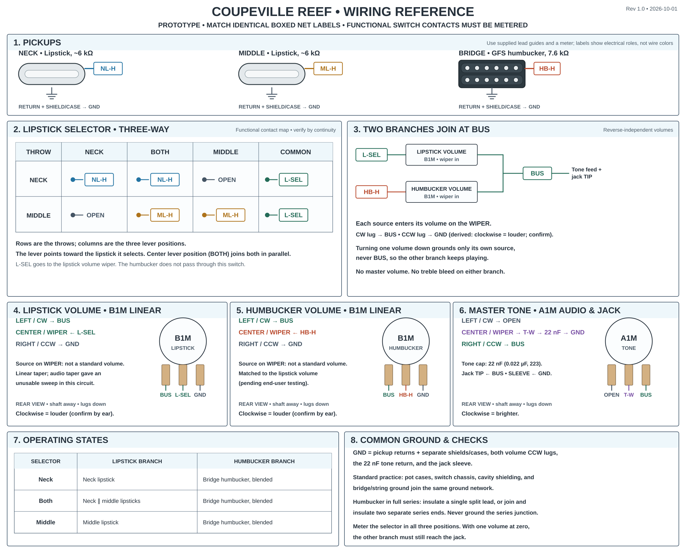

# Coupeville Reef wiring diagram

**Rev 1.0 · 2026-10-01.** Engineering reference for the rewired Coupeville Reef prototype, drawn from the [Coupeville Reef reference design](reference-design.md). It is unpublished: there is no site route or public asset for it. The [source generator](./generate-wiring-diagram.mjs) produces this PNG and an editable [SVG](./wiring-diagram.svg). Its presentation follows the approved [Relay Arc reference](../references/relay-arc-rev-1.0.png) and the STR26002 and Relay Velvet diagrams; the circuit comes only from the Reef reference design.

The selector panel is a **functional contact map**, not a manufacturer lug layout. Identify the actual contacts with a continuity meter. Box colors and pickup drawings show electrical roles, not manufacturer wire colors.

## Operating states

The lipstick selector picks the lipstick branch's source. The humbucker branch is always available. The two branch volumes blend them continuously.

| Lipstick selector | Lipstick branch                     | Humbucker branch                            |
| ----------------- | ----------------------------------- | ------------------------------------------- |
| Neck              | Neck lipstick                       | Bridge humbucker, blended by its own volume |
| Both              | Neck + middle lipsticks in parallel | Bridge humbucker, blended by its own volume |
| Middle            | Middle lipstick                     | Bridge humbucker, blended by its own volume |

Either branch volume at zero removes that branch without grounding the output, so each branch can also be heard alone.

## Netlist

| Net     | Connected terminals                                                                                                                                                                                               |
| ------- | ----------------------------------------------------------------------------------------------------------------------------------------------------------------------------------------------------------------- |
| `NL-H`  | Neck lipstick hot; selector neck throw                                                                                                                                                                            |
| `ML-H`  | Middle lipstick hot; selector middle throw                                                                                                                                                                        |
| `L-SEL` | Selector common; lipstick volume wiper                                                                                                                                                                            |
| `HB-H`  | Bridge humbucker hot; humbucker volume wiper                                                                                                                                                                      |
| `BUS`   | Lipstick volume CW lug; humbucker volume CW lug; tone CCW lug; output jack tip                                                                                                                                    |
| `T-W`   | Tone wiper; 22 nF capacitor (other end to `GND`)                                                                                                                                                                  |
| `GND`   | Lipstick and humbucker returns and separate shields/cases; both volume CCW lugs; tone-cap return; jack sleeve; and, as standard practice, pot cases, selector chassis, cavity shielding, and bridge/string ground |

Unconnected: tone CW lug; humbucker series-junction lead(s), insulated and never grounded (join two separate series ends first if the pickup supplies them).

## Controls

| Control          | Part                                                                         | Rear view, shaft away, lugs down: left / center / right |
| ---------------- | ---------------------------------------------------------------------------- | ------------------------------------------------------- |
| Lipstick volume  | B1M (1 MΩ linear)                                                            | `BUS` / `L-SEL` / `GND`                                 |
| Humbucker volume | B1M (1 MΩ linear), matched to the lipstick volume (pending end-user testing) | `BUS` / `HB-H` / `GND`                                  |
| Master tone      | A1M (1 MΩ audio)                                                             | unused / `T-W` / `BUS`                                  |

Left/center/right are CW/wiper/CCW. Each volume takes its source on the **wiper** and puts its CW lug on `BUS` (reverse-independent wiring, CRL-018), so turning it down grounds only its own source, never `BUS`. With the output on the CW lug, clockwise is louder; the reference design does not say which outer lug the prototype uses, so confirm by turning each knob. Clockwise tone is brighter. No treble bleed on either branch. There is no master volume: `BUS` goes straight to the jack.

## Notes

- The selector lever points toward the lipstick it selects (CRL-005). Confirm the lever direction against the actual switch and its mounting.
- Lipstick models are not named; both are roughly 6 kΩ DCR. The humbucker is the 7.6 kΩ GFS unit described in the reference design.
