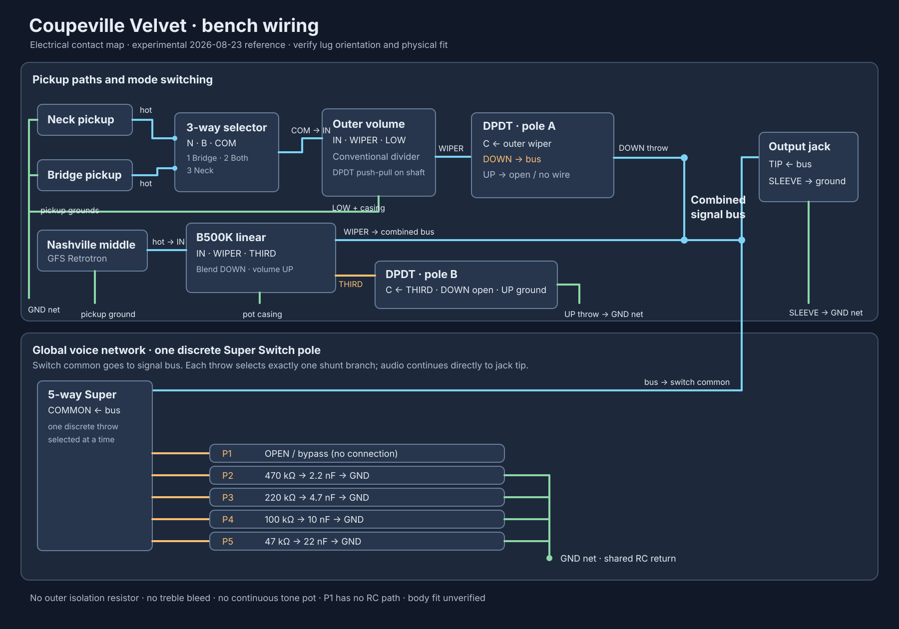

# Coupeville Velvet bench wiring diagram

This is the electrical reference for the 2026-08-23 [engineering log](./2026-08-23-bench-test.md). It is an unpublished bench prototype, not a production harness or a validated physical control layout. The SVG is generated from the repository's [physical wiring component artwork](../../../public/wiring-diagrams/components/metadata.json) by [generate-wiring-diagram.mjs](./generate-wiring-diagram.mjs). The pickup tails in the artwork are replaced with generic hot and ground leads so the drawing does not assign an unverified manufacturer color code.

The 3-way's illustrated N/B input and joined common connections are **functional**, not manufacturer lug positions. The 24-lug 4P5T drawing illustrates the discrete five-way switch because the older library asset named `super-switch.svg` is mislabeled as 4P5T despite showing only 12 lugs. The diagram uses one five-throw pole; unused poles stay unconnected. Identify every common and throw with a continuity meter before soldering.

Orient the Nashville pot so its wiper meets the **input** outer lug at knob 10 and the **third** outer lug at knob 0. In solo mode, that makes 10 full output and 0 grounded silence. Confirm the physical 3-way lever order and both push-pull throw states by continuity; the labels below describe electrical behavior, not a manufacturer's lug numbering.

## Connections

| From | To | Function |
| --- | --- | --- |
| Bridge hot; neck hot | 3-way selector bridge; neck inputs | Positions 1/2/3: bridge, both, neck |
| 3-way selected common(s), joined as the switch requires | Outer volume input | Conventional outer-pickup volume |
| Outer volume grounded outer lug | Common ground | Conventional volume divider |
| Outer volume wiper | DPDT pole A common | Outer branch feed |
| DPDT pole A DOWN throw | Combined signal bus | Connected only when pushed down |
| DPDT pole A UP throw | Unconnected | Disconnects outer branch in Nashville solo mode |
| Nashville hot | B500K linear input outer lug | Middle-pickup feed |
| Nashville B500K wiper | Combined signal bus | Series blend in DOWN mode; solo volume in UP mode |
| Nashville B500K other outer lug | DPDT pole B common | Floating in DOWN mode |
| DPDT pole B DOWN throw | Unconnected | Keeps Nashville pot's third lug floating |
| DPDT pole B UP throw | Common ground | Converts Nashville pot to a volume divider |
| Combined signal bus | Output jack tip; 5-way Super Switch common | Direct output and global voice network |
| 5-way throws 1–5 | Open; 470 kΩ + 2.2 nF; 220 kΩ + 4.7 nF; 100 kΩ + 10 nF; 47 kΩ + 22 nF | Each R and C pair is **in series to ground**, selected as a shunt across the output |
| Pickup grounds, pot casings, RC ground ends, output jack sleeve | Common ground | Shield/return network |

The outer volume wiper connects directly to the bus in DOWN mode, with **no mixing resistor**. The Nashville knob at 0 in DOWN mode still leaves approximately 500 kΩ of series resistance, so the pickup may remain audible. The outer volume at 0 is intended to mute the combined bus in DOWN mode. No treble bleed or continuous tone pot is fitted. The proposed inductor/Varitone network is a future experiment and is not shown.

Check switch contact behavior, blend balance, and all five shunt positions on the bench. Body cavity space, switch depth, terminal clearance, and control spacing remain unverified.
