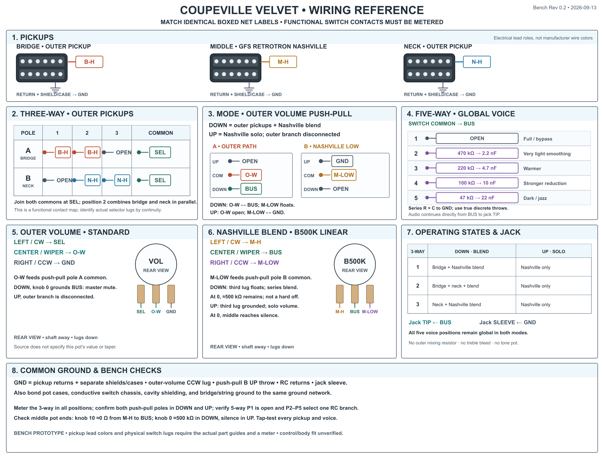

# Coupeville Velvet bench wiring diagram

This is the electrical reference for the 2026-08-23 [engineering log](./2026-08-23-bench-test.md). It is an unpublished bench prototype, not a production harness or a validated physical control layout. Its presentation follows the [Relay Arc wiring reference](../references/relay-arc-rev-1.0.png): numbered light panels, boxed net labels, functional contact maps, rear-view pot diagrams, operating states, and ground checks. The [source generator](./generate-wiring-diagram.mjs) produces the PNG and an editable [SVG](./wiring-diagram.svg). The Arc image is a **visual reference only**; all Coupeville values and connections come from the Coupeville engineering log.

The 3-way and DPDT panels are **functional contact maps**, not manufacturer lug positions. The five-way voice network requires a true discrete 1P5T pole, available on an appropriate Super Switch; an ordinary combining Fender-style five-way is unsuitable. Identify every common and throw with a continuity meter before soldering. Box colors and pickup illustrations identify electrical roles, not manufacturer wire colors or finalized outer-pickup models.

Orient the Nashville pot so its wiper meets the **input** outer lug at knob 10 and the **third** outer lug at knob 0. In solo mode, that makes 10 full output and 0 grounded silence. Confirm the physical 3-way lever order and both push-pull throw states by continuity; the labels below describe electrical behavior, not a manufacturer's lug numbering.

## Net labels

| Net | Connected points |
| --- | --- |
| `B-H` | Bridge hot → 3-way bridge pole throws 1 and 2 |
| `N-H` | Neck hot → 3-way neck pole throws 2 and 3 |
| `SEL` | Both 3-way commons → outer-volume input/CW lug |
| `O-W` | Outer-volume wiper → push-pull pole A common |
| `M-H` | Nashville hot → B500K input/CW lug |
| `M-LOW` | B500K third/CCW lug → push-pull pole B common |
| `BUS` | B500K wiper, pole A DOWN throw, output jack tip, and discrete five-way common |
| `GND` | Pickup returns and separate shields, outer-volume CCW lug, pole B UP throw, RC returns, pot cases, conductive switch chassis, cavity shield, bridge/string ground, and jack sleeve |

The source does not specify an exact outer-volume resistance or taper, nor finalized outer-pickup models for this Coupeville experiment. The pickup drawings show their roles only.

## Connections

| From | To | Function |
| --- | --- | --- |
| Bridge hot; neck hot | 3-way selector bridge; neck inputs | Positions 1/2/3: bridge, both, neck |
| 3-way selected common(s), joined as the switch requires | Outer volume input | Conventional outer-pickup volume |
| Outer volume grounded outer lug | Common ground | Conventional volume divider |
| Outer volume wiper | DPDT pole A common | Outer branch feed |
| DPDT pole A DOWN throw | Combined signal bus | Connected only when pushed down |
| DPDT pole A UP throw | Unconnected | Disconnects outer branch in Nashville solo mode |
| Nashville hot | B500K linear input outer lug | Middle-pickup feed |
| Nashville B500K wiper | Combined signal bus | Series blend in DOWN mode; solo volume in UP mode |
| Nashville B500K other outer lug | DPDT pole B common | Floating in DOWN mode |
| DPDT pole B DOWN throw | Unconnected | Keeps Nashville pot's third lug floating |
| DPDT pole B UP throw | Common ground | Converts Nashville pot to a volume divider |
| Combined signal bus | Output jack tip; 5-way Super Switch common | Direct output and global voice network |
| 5-way throws 1–5 | Open; 470 kΩ + 2.2 nF; 220 kΩ + 4.7 nF; 100 kΩ + 10 nF; 47 kΩ + 22 nF | Each R and C pair is **in series to ground**, selected as a shunt across the output |
| Pickup grounds, pot casings, RC ground ends, output jack sleeve | Common ground | Shield/return network |

The outer volume wiper connects directly to the bus in DOWN mode, with **no mixing resistor**. The Nashville knob at 0 in DOWN mode still leaves approximately 500 kΩ of series resistance, so the pickup may remain audible. The outer volume at 0 is intended to mute the combined bus in DOWN mode. No treble bleed or continuous tone pot is fitted. The proposed inductor/Varitone network is a future experiment and is not shown.

Check switch contact behavior, blend balance, and all five shunt positions on the bench. Body cavity space, switch depth, terminal clearance, and control spacing remain unverified.
