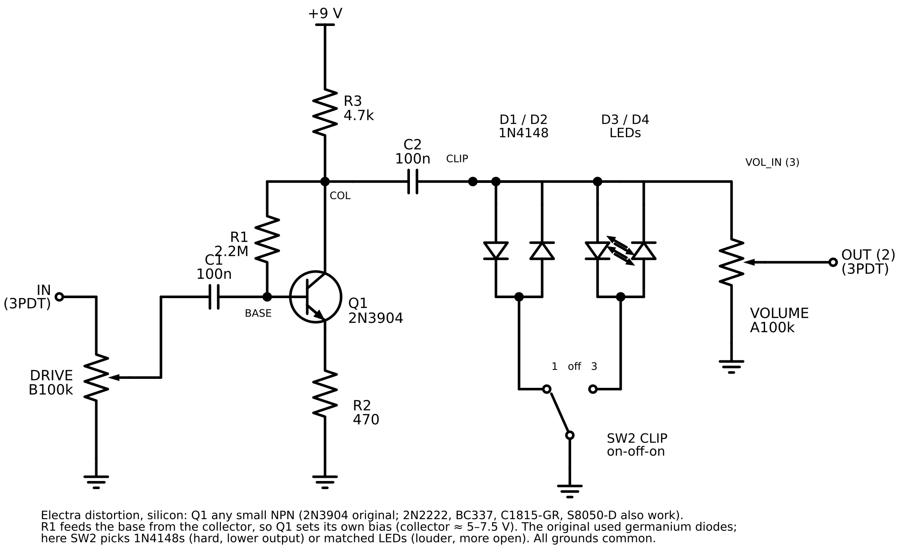

# Electra distortion, silicon (prototype)

Status: **proposed**, 2026-10-03. Netlist simulated in ngspice; not yet built or bench-tested. Unpublished; no site route.

Owner request: an Electra distortion from on-hand parts, no germanium, 1N4148 or LED clipping.

## Design

The Electra (Univox/Electra MPC, documented by AMZ, https://www.muzique.com/tech/electra.htm): one NPN stage, gain about R3/R2 = 10, biased by R1 from collector to base, then a pair of opposed diodes to ground. The original used 1N34A germanium diodes. With no germanium, SW2 picks 1N4148s (hardest, quietest), nothing, or two LEDs (louder and more open). The DRIVE pot is an input level control, as in AMZ's board version.

## Parts

| Ref    | Value                 | Notes                                          |
| ------ | --------------------- | ---------------------------------------------- |
| Q1     | 2N3904                | Or 2N2222, BC337-25, C1815-GR, S8050-D         |
| R1     | 2.2 MΩ                | Collector-to-base bias                         |
| R2     | 470 Ω                 | Emitter                                        |
| R3     | 4.7 kΩ                | Collector load                                 |
| C1, C2 | 100 nF film           | Input and output coupling                      |
| D1, D2 | 1N4148                | Opposed pair                                   |
| D3, D4 | LED × 2               | Opposed pair; same colour so both halves match |
| DRIVE  | B100k                 | Lug 3 from 3PDT lug 2, lug 2 to C1, lug 1 GND  |
| VOLUME | A100k                 | Lug 3 CLIP, lug 2 to 3PDT lug 3, lug 1 GND     |
| SW2    | SPDT on-off-on toggle | Lug 1 1N4148 pair, lug 2 GND, lug 3 LED pair   |

AMZ's parts list also has an optional 1 nF (C3); its position is not stated in text, so it is left out. Footswitch, jacks, LED indicator and battery wire as the Fuzz Face (`../fuzz-face/fuzz-face-footswitch.png`).

## Expected readings (ngspice, 9 V, no signal)

| Node      | 2N3904 | 2N2222 |
| --------- | ------ | ------ |
| Collector | 7.27 V | 7.05 V |
| Base      | 0.81 V | 0.82 V |
| Emitter   | 0.17 V | 0.19 V |

Output with 200 mV in, drive full: about ±0.51 V with 1N4148s, ±1.45 V with LEDs. The collector sits high, so the stage also clips on its own upward swing. If yours reads above 7.5 V, try 1.5 MΩ or 1 MΩ for R1 to centre it.

## Pinout warning

The layouts are drawn for E-B-C parts (2N3904, 2N2222, BC337). C1815 and S8050 are E-C-B; rotate or bend legs so each lands on its labelled hole.

## Files

- `electra-schematic.svg` / `.png`, `electra-breadboard.svg` / `.png`, `electra-stripboard.svg` / `.png` (16 × 7)
- `generate.py`: draws all three; checks both layouts against the netlist first
- SPICE check: `../pedal-diagrams/spice/electra.cir`

## Open items

- Bench-test; record collector voltage and whether R1 needed changing.
