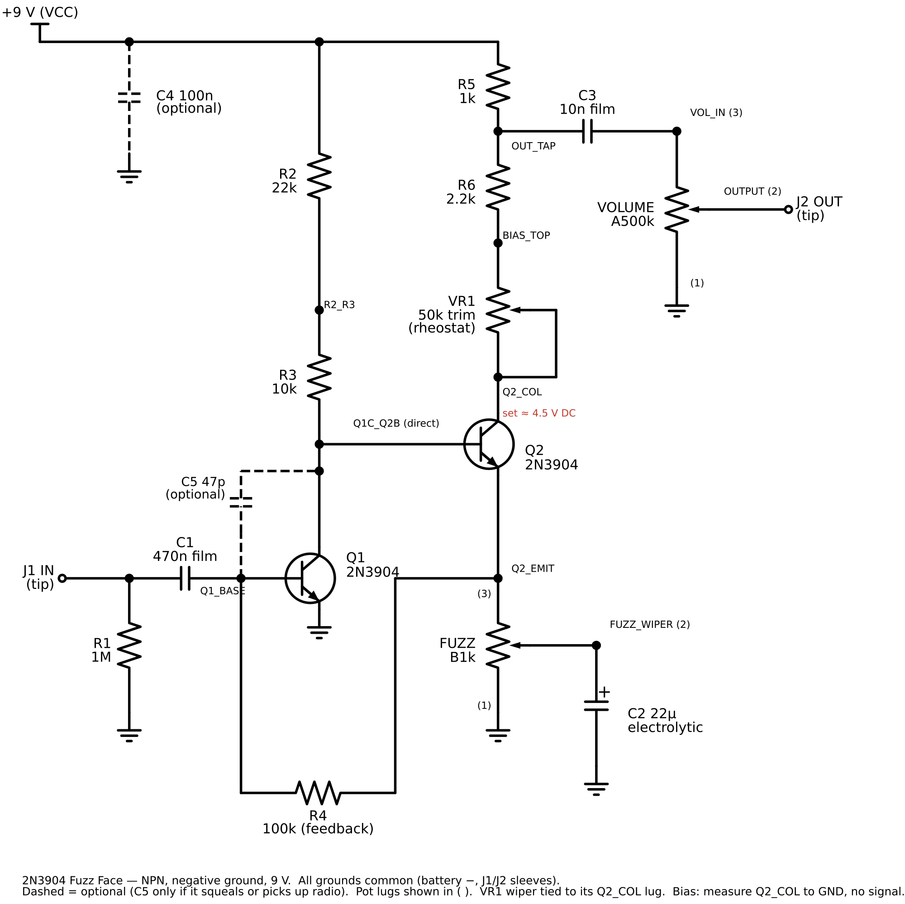

# 2N3904 Fuzz Face (prototype)

Status: **prototype built** — netlist verified on paper 2026-09-28; the owner built the stripboard layout and had it working on 2026-10-02 (see [Bench results](#bench-results-2026-10-02)). DC voltages not yet recorded. The assembly guide is published unlisted; no kit listing.

Owner-supplied netlist: NPN, negative ground, 9 V build from on-hand parts, intended as a possible future kit.

## Reference designators

Resistors were renumbered R1–R7 in signal order on 2026-09-28 (owner decision) so the kit has no gaps or letter suffixes. Mapping from the owner's original netlist: RPD → R1, R1A → R2, R1B → R3, R4 → R4, R2 → R5, R3 → R6. R7 is the LED resistor, added later. The net R1_MID is now R2_R3.

## Parts

| Ref     | Value                    | Notes                                                                                         |
| ------- | ------------------------ | --------------------------------------------------------------------------------------------- |
| Q1, Q2  | 2N3904                   | TO-92, E-B-C with flat face toward you, leads down. Verify against the part's datasheet.      |
| R1      | 1 MΩ                     | Input pulldown (optional)                                                                     |
| C1      | 470 nF film              | Tighter than the classic ~2.2 µF                                                              |
| R2 + R3 | 22 kΩ + 10 kΩ            | 32 kΩ total (classic: 33 kΩ)                                                                  |
| R4      | 100 kΩ                   | Feedback, Q2 emitter to Q1 base                                                               |
| FUZZ    | B1k                      | Lug 3 to Q2_EMIT, lug 1 to GND, wiper to C2 +                                                 |
| C2      | 22 µF electrolytic       | + to fuzz wiper, − to GND                                                                     |
| R5      | 1 kΩ                     | VCC to OUT_TAP. Was 470 Ω; raised 2026-10-03 for output level (see open items).               |
| R6      | 2.2 kΩ                   | OUT_TAP to BIAS_TOP                                                                           |
| VR1     | 50 kΩ trimmer            | Rheostat; wiper tied to Q2_COL lug                                                            |
| C3      | 10 nF film               | OUT_TAP to VOL_IN                                                                             |
| VOLUME  | A500k                    | Lug 3 to VOL_IN, lug 1 to GND, wiper to output                                                |
| C4      | 100 nF film              | Optional supply decoupling                                                                    |
| C5      | 47 pF ceramic            | Optional; Q1 collector to Q1 base. Leave out unless it squeals. 100 pF muffled the prototype. |
| SW1     | 3PDT latching footswitch | True bypass; pole 1 switches the LED                                                          |
| LED     | 5 mm LED + bezel         | On leads through the case; lit when the effect is on                                          |
| R7      | 4.7 kΩ                   | LED current limit, about 1.5 mA from 9 V (off-board, at the LED)                              |
| J1      | Stereo (TRS) 1/4 in jack | Input; ring switches battery − so unplugging saves the battery                                |
| J2      | Mono 1/4 in jack         | Output                                                                                        |
| BAT     | 9 V battery + clip       | Only power source; + to board A10, − to J1 ring                                               |

## Verification notes (paper check, not measured)

- Topology matches the classic Fuzz Face, polarities flipped correctly for NPN and negative ground.
- The full 1 kΩ fuzz pot stays in the DC emitter path, so the fuzz setting does not shift the bias.
- Estimated DC point: Q1 base ≈ 0.65 V, Q2 emitter ≈ 0.7 V, Q2 current ≈ 0.7 mA. That puts Q2_COL at 4.5 V with about 6.5–7 kΩ total collector resistance, so VR1 should land near 3.5 kΩ with R5 at 1 kΩ (near 4 kΩ with the original 470 Ω).
- Bias: with no signal, measure Q2_COL (not OUT_TAP) to GND and set about 4.5 V.

## Open items for a kit

- Board: stripboard, chosen 2026-09-28 over a custom PCB, a 3D-printed component matrix (melt risk), and free-wired assembly (vibration and short risk against foil shielding).
- The stripboard layout assumes an inline-pin trimmer for VR1. Confirm the stocked part's footprint.

- Add reverse-polarity protection, such as a series 1N5817, if the kit uses a DC jack.
- C5: the prototype doesn't need it (see Bench results). Owner decision 2026-10-03 (approved): every kit ships a 47 pF C5, left out unless the pedal squeals. Supersedes the 100 pF value.
- Record measured DC voltages and the final VR1 setting here.
- Output level: the effect was quieter than bypass. Owner decision 2026-10-03 (approved, not yet bench-tested): R5 470 Ω → 1 kΩ, same holes (A14–A18), for about +6 dB. Supersedes 470 Ω. VR1 should land about 0.5 kΩ lower (near 3.5 kΩ) and OUT_TAP should read about 8.3 V. If it's still too quiet, try 2.2 kΩ.
- Q2 gain: the owner finds the fuzz smooth and polite with a 2N3904. See Q2 substitution notes; final choice pending.

## Files

- `bom.md`: kit bill of materials (draft)
- Assembly guide: published unlisted at `/guitars/pedals/fuzz-face`, source `content/pedals/fuzz-face.mdx`. Diagram copies live in `public/images/fuzz_face/guide/`; regenerate here, then copy them over.

- `fuzz-face-2n3904.svg` / `.png`: schematic
- `generate_schematic.py`: schematic source (schemdraw)
- `fuzz-face-breadboard.svg` / `.png`: half-size breadboard layout
- `generate_breadboard.py`: breadboard source; checks the layout's strip connectivity against the schematic netlist before drawing
- `fuzz-face-stripboard.svg` / `.png`: 20 × 8 stripboard layout (component side and copper side with track cuts); the chosen board for the kit
- `fuzz-face-footswitch.svg` / `.png`: 3PDT true-bypass footswitch, jacks, LED, and battery wiring
- `generate_footswitch.py`: footswitch source; checks both switch positions and the battery switching against the stripboard netlist before drawing
- `generate_stripboard.py`: stripboard source; checks strips, cuts, links, and transistor orientation against the netlist before drawing

## Bench results (2026-10-02)

Owner's stripboard build, all optional parts fitted (C4, C5 at 100 pF, R1).

- **Silent with the effect on, bypass fine.** Cause: input and output cables swapped. The owner's quick checks, continuity tests, and DC voltages all matched the diagnostic plan before the swap was found. The plan is now in the guide's Troubleshooting section.
- **Tested once without the FUZZ pot:** silent, as expected (Q2's emitter has no DC path to ground). No damage.
- **Muffled, about half the bypass volume, and little change across the FUZZ knob.** Cause: C5 at 100 pF. Across Q1's collector and base, Miller multiplication makes it act like roughly 10–20 nF from the input to ground (estimate), a treble cut near 1 kHz with typical pickups. Removing C5 fixed it, and the pedal didn't squeal or pick up radio without it. C5 was changed to 47 pF and is now left out unless needed.
- **After removing C5:** the FUZZ knob works and the volume drop is smaller, but the owner finds the fuzz smooth and woolly and still too quiet. Open experiments, cheapest first: lower bias (strip D at 3.8–4.2 V), smaller C1 (100 nF or 47 nF), smaller C2 (4.7–10 µF), R5 at 1 kΩ, and a higher-gain Q2.

Bias character (strip D, Q2's collector): about 3–4 V sounds gated and spitty; about 4.5 V is the most even; about 5–6 V is smoother and more open. Adding VR1 resistance lowers the voltage.

## Q2 substitution notes

Status: **experimental**, not tested. Gain ranges are datasheet grades, not measurements of the owner's parts.

- The circuit is NPN, negative ground. PNP parts (A1015, BC327, S8550, 2N2907, 2N3906) and germanium parts don't fit without reversing the circuit's polarity.
- Higher hFE in Q2 gives a harsher, more saturated fuzz. Q1 works best with moderate gain.
- After any swap, re-set strip D to about 4.5 V, then tune by ear. A 3-pin machined-pin socket in Q2's holes (D13–F13) makes swaps quick.

| Part                    | hFE by grade                                    | Leg order (flat face toward you, leads down) | Fitting Q2's holes                                                |
| ----------------------- | ----------------------------------------------- | -------------------------------------------- | ----------------------------------------------------------------- |
| 2N3904 (stock)          | about 100–300                                   | E-B-C                                        | As drawn                                                          |
| BC337                   | -16: 100–250, -25: 160–400, -40: 250–630        | C-B-E                                        | Turn it around: flat face toward column 1.                        |
| 2SC1815                 | O: 70–140, Y: 120–240, GR: 200–400, BL: 350–700 | E-C-B                                        | B and C legs must cross; sleeve one.                              |
| S8050                   | B: 85–160, C: 120–200, D: 160–300               | Usually E-B-C (check the datasheet)          | As drawn                                                          |
| 2N2222 / PN2222         | about 100–300                                   | E-B-C (TO-92; varies by maker)               | As drawn; little change from a 2N3904.                            |
| 2N5088 / 2N5089, MPSA18 | about 300–1500                                  | E-B-C                                        | As drawn; roughly twice the gain of the parts above. Not on hand. |

The owner has BC337-25, C1815-GR, and S8050-D on hand. Measure hFE and use the highest for Q2.
